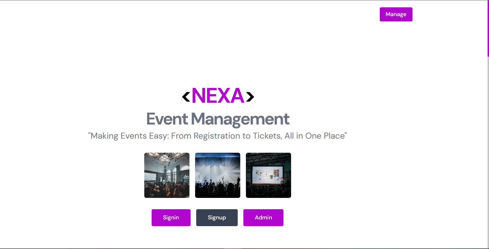

# NEXA

[](https://nextjs.org/)
[](https://nodejs.org/)
[](https://www.mongodb.com/)
[](https://razorpay.com/)

**NEXA** (Networked Event eXperience Architecture) is an event-management platform for organizing events, taking registrations, and selling tickets. Attendees sign in with a one-time email code and book tickets through Razorpay (or free events, with no payment step); admins create and manage events, view registrants, and check attendees in at the door. Product managers manage the admin roster — inviting, viewing, and deactivating admins — from inside the app itself.

## Screenshot



## Key Features

- **OTP-based Sign-In / Sign-Up** — no passwords for attendees; a 6-digit code is emailed, hashed with bcrypt, and expires after 5 minutes (`server/controllers/authController.js`, `server/models/otpAuth.js`).
- **Session Auth** — signing in issues a signed, httpOnly session cookie (`server/libs/session.js`); every protected route re-verifies it (and, for admins, that the account is still active) on every request rather than trusting any id the client sends (`server/middlewares/auth.js`).
- **Admin Roles & Invites** — admins are `admin` or `superadmin`; superadmins invite new admins by email from `/admin/manage-admins`, and the invitee sets their own password via a signed, expiring link (`server/controllers/adminController.js`).
- **Event Creation & Management** — admins create, edit, and delete events with venue, date/time, price, category, optional capacity, and cover/profile images uploaded directly or pasted as a URL (`server/controllers/eventController.js`, `client/src/components/EventForm.jsx`).
- **Ticket Booking & Payments** — Razorpay checkout behind a server-side feature flag (`PAYMENTS_ENABLED`); when it's off or unconfigured, bookings complete through an automatic mock path instead of blocking on payment setup, and free events (price `0`) always skip payment entirely (`server/controllers/paymentController.js`, `server/libs/payments.js`, `client/src/pages/event/[eventId]/payment.jsx`).
- **Waitlists & Cancellations** — once a capacity-limited event fills up, attendees can join a waitlist instead of being turned away; cancelling a booking (with an automatic Razorpay refund for real payments) promotes the next waitlisted person immediately (`server/controllers/paymentController.js`).
- **QR Check-In** — each ticket carries a signed QR code; admins can check attendees in either by scanning it with a camera or by searching the registrant list, from the same Registrations page (`server/controllers/ticketController.js`, `client/src/components/QrScanner.jsx`).
- **Email Notifications** — OTP codes, ticket/pass confirmations, check-in confirmations, and admin invites are all emailed via Nodemailer, with a `DEV_LOG_EMAILS` escape hatch that prints them to the server log instead for local development without real SMTP credentials (`server/controllers/emailController.js`).
- **Attendee Check-In** — admins can search registrants and mark them checked-in from the event's Registrations page (`client/src/pages/event/[eventId]/registration.jsx`).
- **Event Filtering & Pagination** — keyword, category, date-range, and price-range filters on both the user and admin dashboards, filtered and paginated server-side in MongoDB so the list stays fast regardless of how many events exist (`server/controllers/eventController.js`, `client/src/utils/usePaginatedEvents.js`).

## Tech Stack

- **Client**: Next.js 13 (Pages Router), React 18, Tailwind CSS, shadcn/ui-style components on Radix primitives, `rc-slider`, `html5-qrcode`
- **Backend**: Node.js, Express.js
- **Database**: MongoDB (Mongoose)
- **Auth**: JWT (httpOnly session cookies) + bcrypt, email OTP verification, `zod` request validation, `express-rate-limit` on auth endpoints
- **Payments**: Razorpay (feature-flagged, with an automatic mock fallback)
- **Uploads**: `multer` (local disk storage — see the Vercel note under Deployment)
- **Email**: Nodemailer

## Project Structure

This repo holds **two independent npm projects** — each is installed and run separately (there's no shared workspace/monorepo tooling):

```
Nexa.ai/
├── client/                      # Next.js app — user & admin web experience
│   └── src/
│       ├── pages/
│       │   ├── users/            # /users/signup, /users/signin, /users/dashboard, /users/past_events
│       │   ├── admin/             # /admin/auth, /admin/dashboard, /admin/eventform,
│       │   │                      # /admin/manage-admins, /admin/accept-invite
│       │   ├── event/[eventId]/    # /event/[id], .../registration, .../adminevents, .../payment
│       │   └── index.js             # landing page
│       ├── components/                # nav bars, dropdowns, filters, event form, landing sections
│       ├── utils/                      # api.js (fetch + auth), getSession.js (SSR session check)
│       └── styles/
├── server/                       # Express REST API
│   ├── index.js                    # app entry point (Express app, routes, CORS, Mongo connection, error handler)
│   ├── controllers/                 # auth, admin, event, payment, ticket (QR), upload, email, session, user dashboard
│   ├── middlewares/                  # auth (JWT), validate (zod), rateLimit, asyncHandler, upload (multer)
│   ├── models/                        # User, Admin, Event, OtpAuth (Mongoose schemas)
│   ├── schemas/                        # zod request-validation schemas per domain
│   ├── libs/                            # session cookies, response envelope, Razorpay client, QR signing
│   ├── uploads/                          # locally-uploaded event images (gitignored, see Deployment)
│   ├── scripts/bootstrapSuperadmin.js     # one-time CLI: creates the first superadmin
│   └── routes/                             # /user, /admin, /post/event, /payment, /me, ...
└── README.md
```

**How the pieces talk to each other:** the client calls the server over HTTP using `NEXT_PUBLIC_API_URL`, with cookies included on every request (`credentials: "include"`); the server allows that origin via CORS using `DEPLOYED_URL` (with `credentials: true`, required for the session cookie to work cross-origin).

## Prerequisites

- Node.js v18 or higher and npm
- A MongoDB Atlas connection string
- (Optional) A Razorpay account with API keys — payments run in mock mode without one, see below
- An email account for sending OTP/ticket/invite emails via Nodemailer (SMTP host/port are hardcoded to Zoho in `server/controllers/emailController.js` — swap those if you use a different provider)

## Running Locally

1. **Clone the repository**
   ```bash
   git clone https://github.com/ANUSHKAANIM/Nexa.ai.git
   cd Nexa.ai
   ```

2. **Install dependencies** in each project
   ```bash
   cd server && npm install
   cd ../client && npm install
   ```

3. **Configure environment variables** — create `server/.env` and `client/.env.local` with the variables listed in [Environment Variables](#environment-variables).

4. **Start each app** in its own terminal
   ```bash
   cd server && npm start        # Express API on http://localhost:$PORT
   cd client && npm run dev      # Next.js app on http://localhost:3000
   ```

5. **Create your first admin.** There's no open sign-up for admins — run the one-time bootstrap script once against your database:
   ```bash
   cd server && node scripts/bootstrapSuperadmin.js "Your Name" you@example.com "a-strong-password"
   ```
   This creates a `superadmin` who can sign in at `/admin/auth` and invite further admins from `/admin/manage-admins` — no need to run it again after that.

6. **Open the app** at [http://localhost:3000](http://localhost:3000).

## Environment Variables

| Variable | Used by | Lives in | Purpose |
| --- | --- | --- | --- |
| `PORT` | server | `server/.env` | Port the Express API listens on |
| `MONGO_ATLAS_URI` | server | `server/.env` | MongoDB Atlas connection string |
| `JWT_SECRET` | server | `server/.env` | Signing secret for session cookies and admin-invite links |
| `DEPLOYED_URL` | server | `server/.env` | Allowed CORS origin (your client URL) and the base URL used in invite links |
| `NODE_MAILER_USER` / `NODE_MAILER_PASS` | server | `server/.env` | SMTP login for OTP/ticket/check-in/invite emails — for Gmail, `NODE_MAILER_PASS` must be an **App Password**, not your normal login password (see below) |
| `SMTP_HOST` / `SMTP_PORT` / `SMTP_SECURE` | server | `server/.env` | Optional — override the SMTP provider. Defaults to Gmail (`smtp.gmail.com:465`) if unset; e.g. set `SMTP_HOST=smtp.zoho.in` for Zoho instead |
| `MAIL_FROM_NAME` / `MAIL_FROM_ADDRESS` | server | `server/.env` | Optional — cosmetic "From" display name (defaults to `NEXA`) and address (defaults to `NODE_MAILER_USER`; only override this if you've verified a "Send mail as" alias with your provider) |
| `PAYMENTS_ENABLED` | server | `server/.env` | `true` to use real Razorpay checkout; omit or `false` (default) to run every paid booking through the mock path instead |
| `RAZORPAY_KEY_ID` / `RAZORPAY_KEY_SECRET` | server | `server/.env` | Razorpay API keys — used for both taking payments (when `PAYMENTS_ENABLED=true`) and refunding past ones (whenever the keys are present, regardless of the flag) |
| `DEV_LOG_EMAILS` | server | `server/.env` | `true` prints every email (OTPs, invite links, tickets) to the server log instead of sending it — lets you test the full auth/invite flow locally with no real SMTP account |
| `NEXT_PUBLIC_API_URL` | client | `client/.env.local` | Base URL of the server API |

## Usage

1. **Attendees** sign up or sign in with an emailed OTP, then browse/filter events and book tickets from `/users/dashboard`. Paid events go through Razorpay when it's configured, or a one-tap mock booking when it isn't; free events skip payment entirely.
2. **Admins** authenticate at `/admin/auth`, create/edit events from `/admin/eventform`, and manage registrants/check-ins from an event's Registrations page.
3. **Superadmins** additionally manage the admin roster from `/admin/manage-admins` — inviting new admins by email and deactivating existing ones.

## Deployment (Vercel)

NEXA deploys as **two separate Vercel projects** from this one repository:

1. **Backend** — new Vercel project, Root Directory = `server` (uses the included `vercel.json`, which points Vercel at `index.js` as a serverless function). Add every server variable from the table above as an Environment Variable, with `DEPLOYED_URL` set to the frontend project's real URL once you know it.
2. **Frontend** — new Vercel project, Root Directory = `client`, framework preset "Next.js" (auto-detected). Add `NEXT_PUBLIC_API_URL`, pointing at the backend project's URL.

Once both are deployed, update each project's env vars to point at the other's final URL and redeploy.

**Image uploads on Vercel:** the upload endpoint (`multer.diskStorage`) writes to `server/uploads/` on disk, which works on a normal always-on host but **not** on Vercel — serverless functions get a fresh, read-only filesystem per invocation, so an uploaded file wouldn't still be there the next time it's requested. The "Cover/Profile Image" fields in the event form still accept a pasted URL either way, so the app degrades gracefully; if you want uploads to actually work on Vercel, point `server/middlewares/upload.js` at a persistent storage service (e.g. Vercel Blob) instead of local disk.

## Contributing

We welcome contributions. To contribute:

1. Fork the repository.
2. Create a feature branch:
   ```bash
   git checkout -b feature/YourFeature
   ```
3. Commit your changes:
   ```bash
   git commit -m "Add YourFeature"
   ```
4. Push your branch:
   ```bash
   git push origin feature/YourFeature
   ```
5. Submit a pull request.

## Team

- **Anushka Nim** — [LinkedIn](https://www.linkedin.com/in/anushka-nim-861378332) · [GitHub](https://github.com/ANUSHKAANIM) · [Portfolio](https://github.com/ANUSHKAANIM/MyPortfolio)
- **Kartikey Agarwal** — [LinkedIn](https://www.linkedin.com/in/kartikey-agarwal-48769b31b/) · [GitHub](https://github.com/Gewissen65)

## Acknowledgements

- [Next.js](https://nextjs.org/)
- [Node.js](https://nodejs.org/)
- [MongoDB](https://www.mongodb.com/)
- [Razorpay](https://razorpay.com/)
- [Nodemailer](https://nodemailer.com/)

## Contact

For inquiries, contact [nimanushka@gmail.com](mailto:nimanushka@gmail.com).
